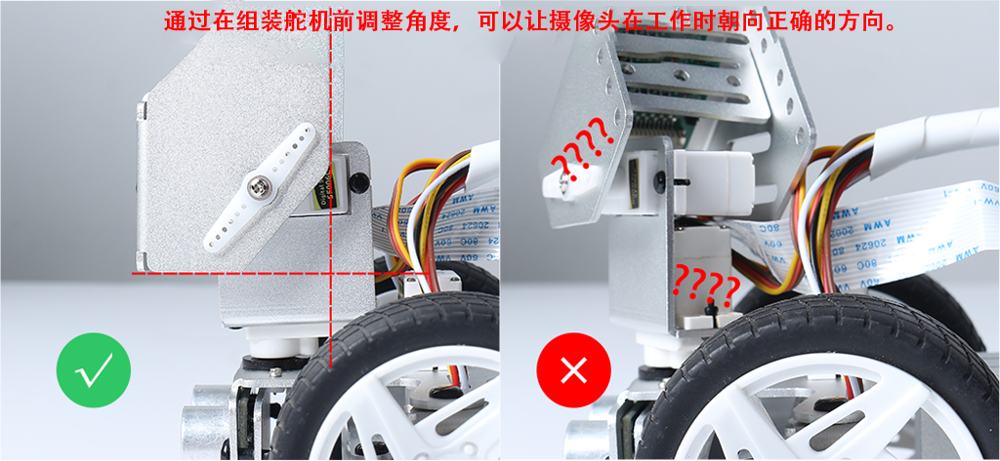

.. note::

    欢迎加入 SunFounder Raspberry Pi & Arduino & ESP32 爱好者社区（Facebook）！与其他爱好者一起深入探索 Raspberry Pi、Arduino 和 ESP32 的世界。

    **为什么要加入？**

    - **专家支持**：通过社区和团队的帮助解决售后问题和技术挑战。
    - **学习与分享**：交流技巧和教程，提升您的技能。
    - **独家预览**：抢先获取新产品发布信息和独家预览。
    - **专属折扣**：享受新品的独家优惠。
    - **节日活动与赠品**：参与赠品活动和节日促销。

    👉 准备好与我们一起探索和创造了吗？点击 [|link_sf_facebook|] 立即加入！

调整舵机以便组装
==========================

在组装舵机之前，必须将其角度设置为零。由于舵机的运动范围有限，将角度设置为零度可以确保舵机从初始位置开始运行，避免在通电时超出其运动范围。如果未提前将舵机设置为零度，可能会导致舵机尝试超出允许范围运动，从而损坏舵机及其连接的机械系统。此步骤至关重要，以确保舵机安全并正常运行。

对于 Python 用户
-----------------------

请参考 :ref:`quick_guide_python` 完成 Raspberry Pi OS 的安装并调整舵机角度。

对于 Ezblock 用户
-------------------------

.. note::

    如果您使用的是 Raspberry Pi 5，EzBlock 图形化编程软件不支持该版本。

安装 EzBlock 系统后，可以使用 P11 引脚调整舵机角度。更多详情请参考 :ref:`servo_adjust` 。
