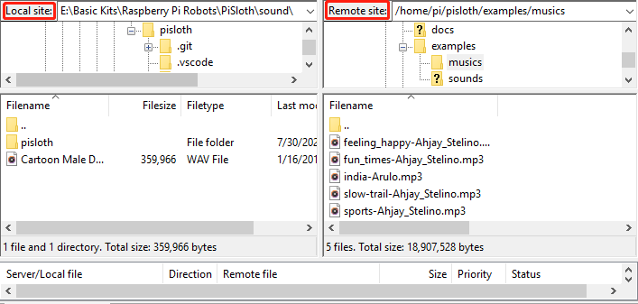

.. note:: 

    您好，欢迎加入 SunFounder Raspberry Pi & Arduino & ESP32 爱好者社区！与其他爱好者一起深入探索 Raspberry Pi、Arduino 和 ESP32 的世界。

    **为什么加入我们？**

    - **专家支持**：通过我们的社区和团队帮助，解决售后问题和技术挑战。
    - **学习与分享**：交流技巧和教程，提升您的技能水平。
    - **独家预览**：抢先获得新产品公告和独家预览机会。
    - **特别折扣**：享受我们最新产品的专属折扣优惠。
    - **节日促销和赠品**：参与节日抽奖和特别促销活动。

    👉 准备好与我们一起探索和创造了吗？点击 [|link_sf_facebook|] 立即加入吧！

.. _filezilla:

Filezilla 软件
==========================

文件传输协议（FTP）是一种标准的通信协议，用于在计算机网络中将文件从服务器传输到客户端。

Filezilla 是一款开源软件，不仅支持 FTP，还支持 FTP over TLS（FTPS）和 SFTP。我们可以使用 Filezilla 将本地文件（如图片、音频等）上传到 Raspberry Pi，也可以将 Raspberry Pi 上的文件下载到本地。

**步骤 1**：下载 Filezilla

从 `Filezilla 官方网站 <https://filezilla-project.org/>`_ 下载客户端。Filezilla 提供了详细的教程，您可以参考： `Documentation - Filezilla <https://wiki.filezilla-project.org/Documentation>`_。

**步骤 2**：连接到 Raspberry Pi

安装完成后，打开软件并 `连接到 FTP 服务器 <https://wiki.filezilla-project.org/Using#Connecting_to_an_FTP_server>`_。它提供了三种连接方式，这里我们使用 **快速连接** 栏。输入 **主机名/IP**、**用户名**、**密码** 和 **端口（22）**，然后点击 **快速连接** 或按下 **Enter** 键连接到服务器。

.. image:: img/filezilla_connect.png

.. note::

    快速连接是测试登录信息的好方法。如果您想创建永久条目，可以在成功快速连接后选择 **文件** -> **将当前连接复制到站点管理器**，输入名称并点击 **确定**。下次您可以通过 **文件** -> **站点管理器** 中选择保存的站点连接。
    
    .. image:: img/ftp_site.png

**步骤 3**：上传/下载文件

您可以通过拖放的方式将本地文件上传到 Raspberry Pi，或将 Raspberry Pi 内的文件下载到本地。

