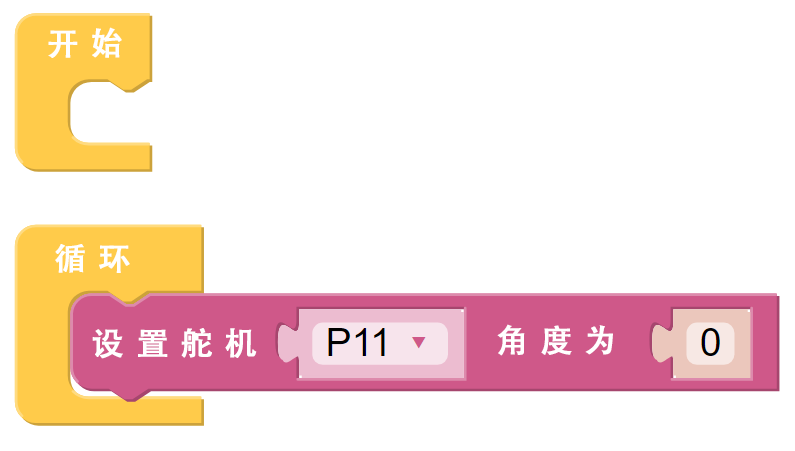
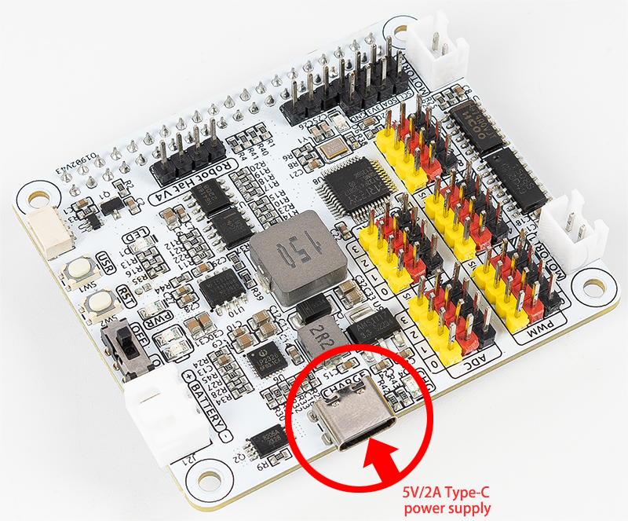

.. note::

    Bonjour, bienvenue dans la communauté des passionnés de Raspberry Pi, Arduino et ESP32 de SunFounder sur Facebook ! Plongez dans l'univers du Raspberry Pi, Arduino et ESP32 avec d'autres passionnés.

    **Pourquoi nous rejoindre ?**

    - **Support d'experts** : Résolvez des problèmes après-vente et des défis techniques grâce à l'aide de notre communauté et de notre équipe.
    - **Apprendre et partager** : Échangez des astuces et des tutoriels pour améliorer vos compétences.
    - **Aperçus exclusifs** : Obtenez un accès anticipé aux nouvelles annonces de produits et des avant-premières.
    - **Réductions exclusives** : Profitez de réductions spéciales sur nos nouveaux produits.
    - **Promotions et cadeaux festifs** : Participez à des concours et des promotions festives.

    👉 Prêt à explorer et à créer avec nous ? Cliquez sur [|link_sf_facebook|] et rejoignez-nous dès aujourd'hui !

FAQ
===========================

Q1 : Après avoir installé Ezblock OS, le servo ne peut pas se positionner à 0° ?
------------------------------------------------------------------------------------

1) Vérifiez si le câble du servo est correctement connecté et si le Robot HAT est alimenté.
2) Appuyez sur le bouton Reset.
3) Si vous avez déjà exécuté un programme dans Ezblock Studio, le programme personnalisé pour P11 n'est plus disponible. Vous pouvez vous référer à l'image ci-dessous pour écrire manuellement un programme dans Ezblock Studio afin de régler l'angle du servo à 0°.

Q2 : Lorsque j'utilise VNC, il m'est indiqué que le bureau ne peut pas être affiché pour le moment ?
---------------------------------------------------------------------------------------------------------

Dans le Terminal, tapez ``sudo raspi-config`` pour modifier la résolution.

Q3 : Pourquoi le servo revient-il parfois en position centrale sans raison apparente ?
------------------------------------------------------------------------------------------

Lorsque le servo est bloqué par une structure ou un autre objet et qu'il ne peut pas atteindre sa position prévue, il entre en mode de protection contre la surchauffe pour éviter d'être endommagé par un courant trop élevé.

Après une période d'extinction, si aucun signal PWM n'est envoyé au servo, il reviendra automatiquement à sa position d'origine.

Q4 : Où puis-je trouver un tutoriel détaillé sur le Robot HAT ?
---------------------------------------------------------------------

Vous pouvez consulter un tutoriel complet sur le Robot HAT ici, avec des informations sur son matériel et son API.

* |link_robot_hat|

Q5 : À propos du chargeur de batterie
-------------------------------------------------------------------

Pour charger la batterie, il suffit de connecter une alimentation Type-C de 5V/2A au port d'alimentation du Robot Hat. Il n'est pas nécessaire d'allumer l'interrupteur d'alimentation du Robot Hat pendant la charge.
Vous pouvez également utiliser l'appareil pendant que la batterie se recharge.

Pendant la charge, la puissance d'entrée est amplifiée par la puce de charge pour recharger la batterie tout en alimentant simultanément le convertisseur DC-DC pour une utilisation externe, avec une puissance de charge d'environ 10 W.
Si la consommation d'énergie externe reste élevée pendant une période prolongée, la batterie peut compléter l'alimentation électrique, de la même manière que lorsque vous utilisez un téléphone en charge. Cependant, veillez à surveiller la capacité de la batterie pour éviter qu'elle ne se décharge complètement lors d'une utilisation et d'une charge simultanées.

Q6 : La caméra ne fonctionne pas ? 
-----------------------------------------------------

Si la caméra ne s’affiche pas ou s’affiche incorrectement, suivez ces étapes de dépannage :

#. Assurez-vous que le câble FPC de la caméra est bien connecté. Il est recommandé de reconnecter la caméra, puis de rallumer l’appareil.

.. raw:: html

       

           <video center loop autoplay muted style="max-width:90%">
               <source src="_static/video/rpi_connect1.mp4" type="video/mp4">
               Votre navigateur ne supporte pas la balise vidéo.
           </video>
       

2. Utilisez la commande suivante pour vérifier si la caméra est reconnue.

.. code-block::

    libcamera-hello
