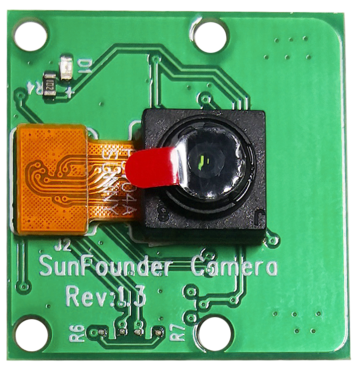
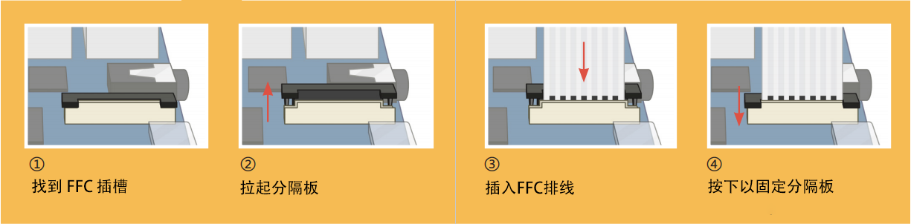

摄像头模块
====================================

**描述**

这是一个 5MP 的 Raspberry Pi 摄像头模块，搭载 OV5647 传感器。它支持即插即用，只需将附带的排线连接到 Raspberry Pi 的 CSI（摄像头串行接口）端口，即可开始使用。

该模块尺寸小巧，仅约 25mm x 23mm x 9mm，重量仅 3g，非常适合移动或其他对尺寸和重量敏感的应用。摄像头模块的原生分辨率为 500 万像素，配备板载定焦镜头，可拍摄 2592 x 1944 像素的静态图像，同时支持 1080p30、720p60 和 640x480p90 的视频录制。

.. note:: 

   该模块只能拍摄照片和视频，无法录制声音。

**规格**

* **静态图像分辨率** ：2592×1944 
* **支持的视频分辨率** ：1080p/30 fps、720p/60 fps 和 640x480p 60/90 视频录制 
* **光圈 (F)** ：1.8 
* **视角** ：65 度 
* **尺寸** ：24mm x 23.5mm x 8mm 
* **重量** ：3g 
* **接口** ：CSI 连接器 
* **支持的操作系统** ：Raspberry Pi OS（推荐使用最新版本）

**安装摄像头模块**

在摄像头模块或 Raspberry Pi 上，您会发现一个扁平的塑料连接器。小心地将黑色固定开关拉出，
直到部分拉开。按图示方向将 FFC 排线插入塑料连接器，然后将固定开关推回到原位。

如果 FFC 排线正确安装，它会保持平直，并且在轻拉时不会松脱。如果未正确安装，请重新插入。

.. image:: img/1.10_camera.png
   :width: 700

.. warning::

   请勿在通电状态下安装摄像头，否则可能会损坏摄像头。

.. **Enable the Camera Interface**

.. Run the following command to enable the camera interface of your Raspberry Pi. If you have enabled it, skip this; if you do not know whether you have done that or not, please continue.

.. .. raw:: html

..    <run></run>

..    sudo raspi-config

.. **3 Interfacing options**

.. .. image:: img/image282.png
..    :align: center

.. **P1 Camera**

.. .. image:: img/camera_config1.png
..    :align: center

.. **<Yes>, then <Ok> -> <Finish>**

.. .. image:: img/camera_config2.png
..    :align: center

.. After the configuration is complete, it is recommended to reboot the Raspberry Pi.

.. .. raw:: html

..    <run></run>

..    sudo reboot