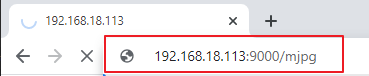

.. note::

    欢迎加入 SunFounder Raspberry Pi & Arduino & ESP32 爱好者社区（Facebook）！与全球的爱好者一起深入探索 Raspberry Pi、Arduino 和 ESP32 的奥秘。

    **为什么要加入？**

    - **专业支持**：在社区和团队的帮助下，快速解决售后问题和技术难题。
    - **学习与分享**：交流技巧与教程，提升您的技能。
    - **独家预览**：抢先了解新产品发布及独家内容。
    - **专属折扣**：享受最新产品的独家优惠。
    - **节日促销与赠品活动**：参与抽奖活动及节日促销。

    👉 准备好与我们一起探索和创造了吗？点击 [|link_sf_facebook|] 马上加入！

.. _py_bull_fight:

10. 公牛冲锋
=============================

让 PiCar-X 变成愤怒的公牛！使用它的摄像头追踪并冲向红色布料！

**运行代码**

.. raw:: html

    <run></run>

.. code-block::

    cd ~/picar-x/example
    sudo python3 10.bull_fight.py

**查看视频画面**

代码运行后，终端将显示以下提示信息：

.. code-block::

    No desktop !
    * Serving Flask app "vilib.vilib" (lazy loading)
    * Environment: production
    WARNING: Do not use the development server in a production environment.
    Use a production WSGI server instead.
    * Debug mode: off
    * Running on http://0.0.0.0:9000/ (Press CTRL+C to quit)

然后在浏览器中输入 ``http://<你的 IP>:9000/mjpg``，即可查看视频画面，例如： ``https://192.168.18.113:9000/mjpg``

**代码**

.. note::
    您可以 **修改/重置/复制/运行/停止** 以下代码。但在此之前，需进入源码路径，例如 ``picar-x\examples``。修改代码后，您可以直接运行以查看效果。

.. raw:: html

    <run></run>

.. code-block:: python

    from picarx import Picarx
    from time import sleep
    from vilib import Vilib

    px = Picarx()

    def clamp_number(num,a,b):
        return max(min(num, max(a, b)), min(a, b))

    def main():
        Vilib.camera_start()
        Vilib.display()
        Vilib.color_detect("red")
        speed = 50
        dir_angle=0
        x_angle =0
        y_angle =0
        while True:
            if Vilib.detect_obj_parameter['color_n']!=0:
                coordinate_x = Vilib.detect_obj_parameter['color_x']
                coordinate_y = Vilib.detect_obj_parameter['color_y']

                # 调整云台角度以追踪目标
                x_angle +=(coordinate_x*10/640)-5
                x_angle = clamp_number(x_angle,-35,35)
                px.set_cam_pan_angle(x_angle)

                y_angle -=(coordinate_y*10/480)-5
                y_angle = clamp_number(y_angle,-35,35)
                px.set_cam_tilt_angle(y_angle)

                # 移动
                # 为避免高速变化时画面混乱，移动方向的变化速度比云台角度变化更慢
                if dir_angle > x_angle:
                    dir_angle -= 1
                elif dir_angle < x_angle:
                    dir_angle += 1
                px.set_dir_servo_angle(x_angle)
                px.forward(speed)
                sleep(0.05)

            else :
                px.forward(0)
                sleep(0.05)

    if __name__ == "__main__":
        try:
            main()
        finally:
            px.stop()
            print("stop and exit")
            sleep(0.1)

**工作原理**

您需要注意以下三个部分的实现：

1. 定义主函数：

    * 使用 ``Vilib.camera_start()`` 启动摄像头。
    * 使用 ``Vilib.display()`` 显示摄像头画面。
    * 使用 ``Vilib.color_detect("red")`` 启用颜色检测功能，并将目标颜色设置为“红色”。
    * 初始化变量： ``speed`` 表示小车的移动速度， ``dir_angle`` 表示小车的移动方向角度， ``x_angle`` 和 ``y_angle`` 分别表示摄像头的水平和垂直角度。

2. 进入循环 (while True) 追踪红色物体：

    * 检查是否检测到红色物体（ ``Vilib.detect_obj_parameter['color_n'] != 0`` ）。
    * 如果检测到红色物体，获取其坐标（ ``coordinate_x`` 和 ``coordinate_y`` ）。
    * 根据检测到的物体位置计算新的云台水平角和垂直角（ ``x_angle`` 和 ``y_angle`` ），并调整角度以追踪目标。
    * 使用 ``clamp_number`` 函数限制云台角度在指定范围内。
    * 使用 ``px.set_cam_pan_angle()`` 和 ``px.set_cam_tilt_angle()`` 设置摄像头角度，使目标保持在画面中心。

3. 根据 dir_angle 和 ``x_angle`` 的差值控制小车运动：

    * 如果 ``dir_angle`` 大于 ``x_angle`` ，则每次递减 ``dir_angle`` 的值以逐步改变方向。
    * 如果 ``dir_angle`` 小于 ``x_angle`` ，则每次递增 ``dir_angle`` 的值。
    * 使用 ``px.set_dir_servo_angle()`` 设置小车方向舵机的角度以控制转向。
    * 使用 ``px.forward(speed)`` 以指定速度移动小车。
