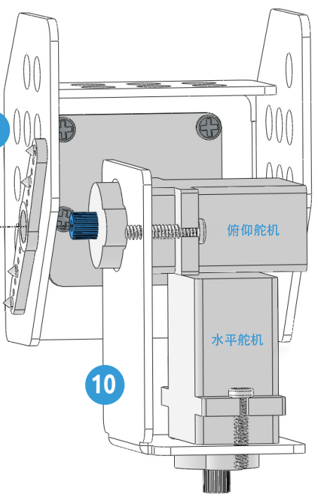

.. note::

    欢迎加入 SunFounder Raspberry Pi & Arduino & ESP32 爱好者社区（Facebook）！与全球的爱好者一起深入探索 Raspberry Pi、Arduino 和 ESP32 的奥秘。

    **为什么要加入？**

    - **专业支持**：在社区和团队的帮助下，快速解决售后问题和技术难题。
    - **学习与分享**：交流技巧与教程，提升您的技能。
    - **独家预览**：抢先了解新产品发布及独家内容。
    - **专属折扣**：享受最新产品的独家优惠。
    - **节日促销与赠品活动**：参与抽奖活动及节日促销。

    👉 准备好与我们一起探索和创造了吗？点击 [|link_sf_facebook|] 马上加入！

.. _py_move:

1. 让 PiCar-X 动起来
========================

这是第一个项目，让我们测试一下 PiCar-X 的基本移动功能。

**运行代码**

.. raw:: html

    <run></run>

.. code-block::

    cd ~/picar-x/example
    sudo python3 1.move.py

运行代码后，PiCar-X 将向前移动，按照 S 形转向，停止并摇动“头部”。

**代码**

.. note::
    您可以 **修改/重置/复制/运行/停止** 以下代码。但在此之前，需进入源码路径，例如 ``picar-x/example``。修改代码后，您可以直接运行以查看效果。

.. raw:: html

    <run></run>

.. code-block:: python

    from picarx import Picarx
    import time

    if __name__ == "__main__":
        try:
            px = Picarx()
            px.forward(30)
            time.sleep(0.5)
            for angle in range(0,35):
                px.set_dir_servo_angle(angle)
                time.sleep(0.01)
            for angle in range(35,-35,-1):
                px.set_dir_servo_angle(angle)
                time.sleep(0.01)        
            for angle in range(-35,0):
                px.set_dir_servo_angle(angle)
                time.sleep(0.01)
            px.forward(0)
            time.sleep(1)

            for angle in range(0,35):
                px.set_camera_servo1_angle(angle)
                time.sleep(0.01)
            for angle in range(35,-35,-1):
                px.set_camera_servo1_angle(angle)
                time.sleep(0.01)        
            for angle in range(-35,0):
                px.set_camera_servo1_angle(angle)
                time.sleep(0.01)
            for angle in range(0,35):
                px.set_camera_servo2_angle(angle)
                time.sleep(0.01)
            for angle in range(35,-35,-1):
                px.set_camera_servo2_angle(angle)
                time.sleep(0.01)        
            for angle in range(-35,0):
                px.set_camera_servo2_angle(angle)
                time.sleep(0.01)
                
        finally:
            px.forward(0)

**工作原理**

PiCar-X 的基本功能由 ``picarx`` 模块提供，
可用于控制方向舵机和车轮，
实现 PiCar-X 前进、S 形转向或摇头等动作。

以下代码引入了支持 PiCar-X 基本功能的库。
这些行代码会出现在涉及 PiCar-X 移动的所有示例中。

.. code-block:: python
    :emphasize-lines: 0

    from picarx import Picarx
    import time

接下来的代码使用 ``for`` 循环，使 PiCar-X
向前移动、改变方向，并操控摄像头的云台角度。

.. code-block:: python

    px.forward(speed)    
    px.set_dir_servo_angle(angle)
    px.set_camera_servo1_angle(angle)
    px.set_camera_servo2_angle(angle)

* ``forward()`` : 以指定的 ``speed`` 让 PiCar-X 前进。
* ``set_dir_servo_angle`` : 将方向舵机转至指定的 ``angle`` 。
* ``set_cam_pan_angle`` : 将云台的水平舵机转至指定的 ``angle`` 。
* ``set_cam_tilt_angle`` : 将云台的垂直舵机转至指定的 ``angle`` 。

