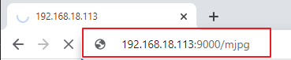

.. _py_video:

9. 视频录制
==================

本示例将指导您如何使用视频录制功能。

**运行代码**

.. raw:: html

    <run></run>

.. code-block::

    cd ~/picar-x/example
    sudo python3 9.record_video.py

运行代码后，您可以在浏览器中输入 ``http://<您的 IP>:9000/mjpg`` 以查看视频画面，例如： ``http://192.168.18.113:9000/mjpg``

可以通过键盘按键启动或停止录制。

* 按下 ``q`` 开始录制或暂停/继续，按下 ``e`` 停止录制并保存。
* 如果需要退出程序，按 ``ctrl+c`` 。

**代码**

.. code-block:: python

    from time import sleep, strftime, localtime
    from vilib import Vilib
    import readchar
    import os

    manual = '''
    Press keys on keyboard to control recording:
        Q: record/pause/continue
        E: stop
        Ctrl + C: Quit
    '''

    def print_overwrite(msg,  end='', flush=True):
        print('\r\033[2K', end='',flush=True)
        print(msg, end=end, flush=True)

    def main():
        rec_flag = 'stop' # start,pause,stop
        vname = None
        username = os.getlogin()
        
        Vilib.rec_video_set["path"] = f"/home/{username}/Videos/" # set path

        Vilib.camera_start(vflip=False,hflip=False)
        Vilib.display(local=True,web=True)
        sleep(0.8)  # wait for startup

        print(manual)
        while True:
            # 读取键盘输入
            key = readchar.readkey()
            key = key.lower()
            # 开始或暂停录制
            if key == 'q':
                key = None
                if rec_flag == 'stop':
                    rec_flag = 'start'
                    # 设置文件名
                    vname = strftime("%Y-%m-%d-%H.%M.%S", localtime())
                    Vilib.rec_video_set["name"] = vname
                    # 开始录制
                    Vilib.rec_video_run()
                    Vilib.rec_video_start()
                    print_overwrite('rec start ...')
                elif rec_flag == 'start':
                    rec_flag = 'pause'
                    Vilib.rec_video_pause()
                    print_overwrite('pause')
                elif rec_flag == 'pause':
                    rec_flag = 'start'
                    Vilib.rec_video_start()
                    print_overwrite('continue')
            # stop
            elif key == 'e' and rec_flag != 'stop':
                key = None
                rec_flag = 'stop'
                Vilib.rec_video_stop()
                print_overwrite("The video saved as %s%s.avi"%(Vilib.rec_video_set["path"],vname),end='\n')
            # 退出程序
            elif key == readchar.key.CTRL_C:
                Vilib.camera_close()
                print('\nquit')
                break

            sleep(0.1)

    if __name__ == "__main__":
        main()

**工作原理**

与录制相关的功能包括以下内容：

* ``Vilib.rec_video_run(video_name)``：启动录制线程。 ``video_name`` 是视频文件的名称，应为字符串格式。
* ``Vilib.rec_video_start()``：开始或继续录制。
* ``Vilib.rec_video_pause()``：暂停录制。
* ``Vilib.rec_video_stop()``：停止录制。

``Vilib.rec_video_set["path"] = f"/home/{username}/Videos/"`` 用于设置视频文件的存储位置。
