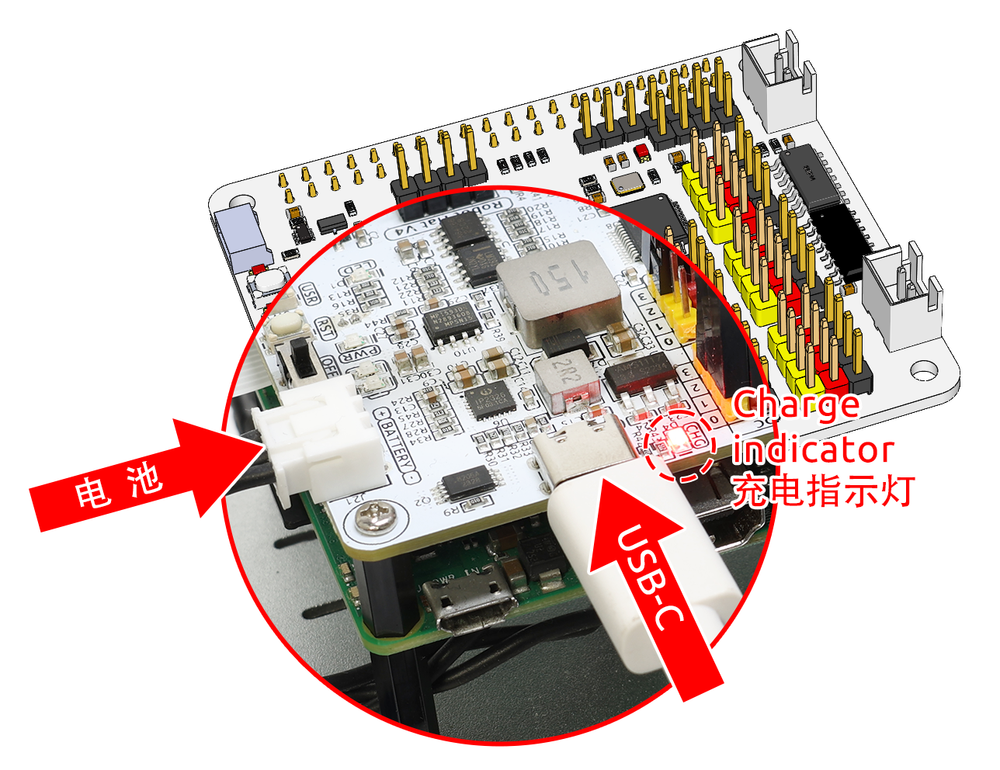
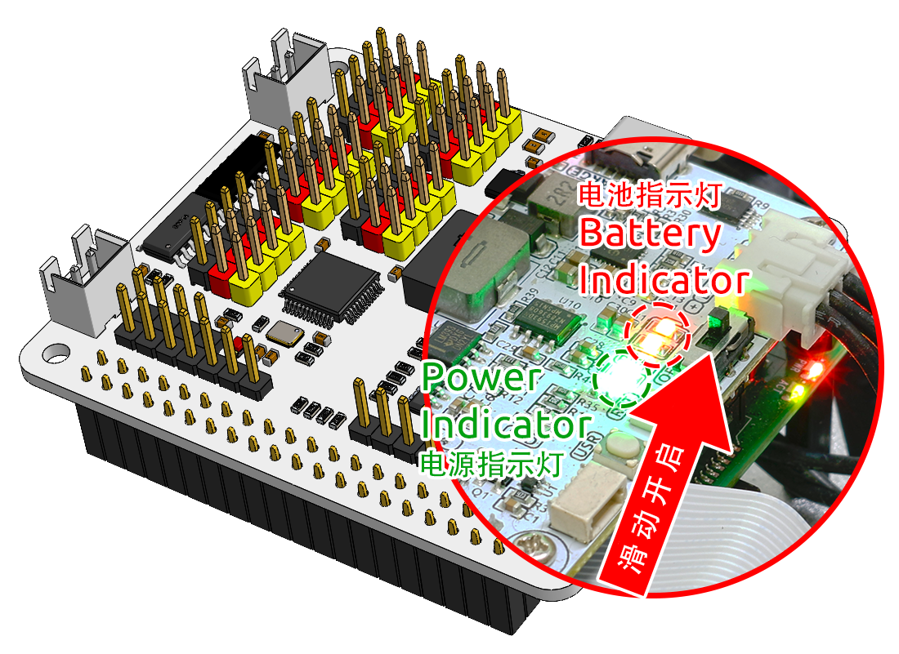

3. 树莓派电源供应（重要）
=====================================================

充电
-------------------

插入电池连接线，然后插入 USB-C 充电线为电池充电。您需要自备充电器，我们建议使用 5V 3A 的充电器，或者您常用的智能手机充电器也可以满足需求。

.. note::
    连接外部 Type-C 电源到机器人扩展板的 Type-C 接口后，电池将自动开始充电，并点亮红色指示灯。\
    当电池充满时，红色指示灯会自动熄灭。

开机
----------------------

打开电源开关。电源指示灯和电池电量指示灯将亮起。

等待几秒钟，您会听到轻微的蜂鸣声，表示树莓派已成功启动。

.. note::
    如果电池电量指示灯都不亮，请为电池充电。
    如果需要长时间编程或调试，您可以在为电池充电的同时插入 USB-C 充电线，保持树莓派正常运行。
